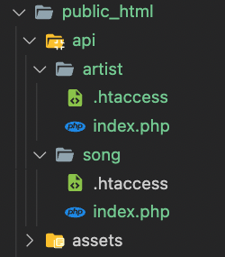

# Routing i PHP
Routing sammenlignes med et slags vejnet i vores applikation. Via en router kan vi styre hvad brugerne skal se, når de tilgår en URL i applikationen. Disse URL'ere kaldes også for *endpoints*.

I en router kan man definere et endpoint med en metode som typisk en en get (hent), post (opret), put (opdater), delete (slet).

Routing er næsten et must når vi arbejder med RestFul API - også i PHP. Men umiddelbart har vi kun adgang til metoderne GET og POST når vi snakker om request methods. Derfor er vi nødt til enten at bygge en router selv eller finde en på nettet. Denne guide tager udgangspunkt i, hvordan du opsætter og anvender en simpel PHP router fra SteamPixel.

## Filstruktur
Routeren sætter lidt krav til vores filstruktur, da vi skal lave noget URL rewrite på alle vores endpoints for at få den til at virke. Herunder kan du se et forslag til en filstruktur:



Undermapperne i api mappen repræsenterer vores endpoints. Så hvis vi kalder url `/api/song` lander vi i mappen */api/song* og hvis vi kalder url'en `/api/artist` lander vi i mappen */api/artist* osv.

## Router class
Kopier følgende kode og sæt det ind i filen route.php i din `/core/classes` mappe.
```php
class Route
{
    private static $routes = array();
    private static $pathNotFound = null;
    private static $methodNotAllowed = null;

    public static function add($expression, $function, $method = 'get')
    {
        array_push(self::$routes, array(
            'expression' => $expression,
            'function' => $function,
            'method' => $method
        ));
    }

    public static function pathNotFound($function)
    {
        self::$pathNotFound = $function;
    }

    public static function methodNotAllowed($function)
    {
        self::$methodNotAllowed = $function;
    }

    public static function run($basepath = '/')
    {

        // Parse current url
        $parsed_url = parse_url($_SERVER['REQUEST_URI']); //Parse Uri

        if (isset($parsed_url['path'])) {
            $path = $parsed_url['path'];
        } else {
            $path = '/';
        }

        // Get current request method
        $method = $_SERVER['REQUEST_METHOD'];

        $path_match_found = false;

        $route_match_found = false;

        foreach (self::$routes as $route) {

            // If the method matches check the path

            // Add basepath to matching string
            if ($basepath != '' && $basepath != '/') {
                $route['expression'] = '(' . $basepath . ')' . $route['expression'];
            }

            // Add 'find string start' automatically
            $route['expression'] = '^' . $route['expression'];

            // Add 'find string end' automatically
            $route['expression'] = $route['expression'] . '$';

            // echo $route['expression'].'<br />';

            // Check path match
            if (preg_match('#' . $route['expression'] . '#', $path, $matches)) {

                $path_match_found = true;

                // Check method match
                if (strtolower($method) == strtolower($route['method'])) {

                    array_shift($matches); // Always remove first element. This contains the whole string

                    if ($basepath != '' && $basepath != '/') {
                        array_shift($matches); // Remove basepath
                    }

                    call_user_func_array($route['function'], $matches);

                    $route_match_found = true;

                    // Do not check other routes
                    break;
                }
            }
        }

        // No matching route was found
        if (!$route_match_found) {

            // But a matching path exists
            if ($path_match_found) {
                header("HTTP/1.0 405 Method Not Allowed");
                if (self::$methodNotAllowed) {
                    call_user_func_array(self::$methodNotAllowed, array($path, $method));
                }
            } else {
                header("HTTP/1.0 404 Not Found");
                if (self::$pathNotFound) {
                    call_user_func_array(self::$pathNotFound, array($path));
                }
            }
        }
    }
}
```
## .htaccess
Kopier derefter følgende kode og sæt det ind i en `.htaccess` fil i din endpoint mappe (`/api/song`, `/api/artist`). Der skal ligge en `.htaccess` i hver mappe:
```
DirectoryIndex index.php

# enable apache rewrite engine
RewriteEngine on

# set your rewrite base
# Edit this in your init method too if you script lives in a subfolder
RewriteBase /

# Deliver the folder or file directly if it exists on the server
RewriteCond %{REQUEST_FILENAME} !-f
RewriteCond %{REQUEST_FILENAME} !-d
 
# Push every request to index.php
RewriteRule ^(.*)$ /api/song/index.php [QSA]
```
## Anvendelse af router
Opret nu en index.php fil i din endpoint mappe - og inkluder din init fil i den.

